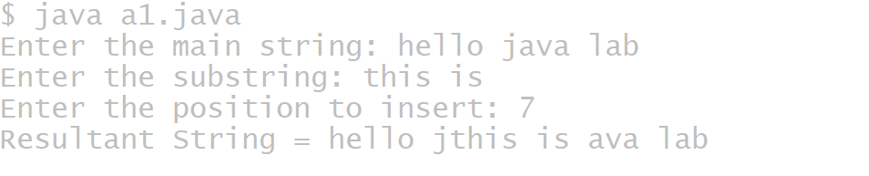
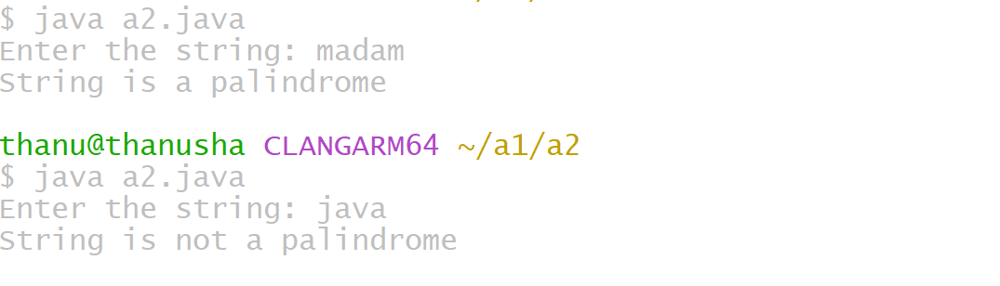

# ADDITIONAL EXPERIMENTS
## TITLE :1) INSERT A SUBSTRING
```java
import java.util.Scanner;

class SubstringInsert {
    public static void main(String[] args) {
        Scanner sc = new Scanner(System.in);

        String mainString;
        String subString;
        int position;

        System.out.print("Enter the main string: ");
        mainString = sc.nextLine();

        System.out.print("Enter the substring: ");
        subString = sc.nextLine();

        System.out.print("Enter the position to insert: ");
        position = sc.nextInt();

        int length = mainString.length();
        String resultString;

        if (position >= 0 && position <= length) {
            String firstPart = mainString.substring(0, position);
            String secondPart = mainString.substring(position);

            resultString = firstPart + subString + secondPart;

            System.out.println("Resultant String = " + resultString);
        } else {
            System.out.println("Substring cannot be inserted.");
            System.out.println("Condition: 0 <= position <= " + length);
        }

        sc.close();
    }
}
```



## TITLE :2)Fibonacci numbers
```java
import java.util.Scanner;

 class Fibonaccisum {

    public static void main(String[] args) {
        Scanner sc = new Scanner(System.in);

        System.out.print("Enter n: ");
        int n = sc.nextInt();

        long sum = fibonacciSum(n);
        System.out.println("Sum of first " + n + " Fibonacci numbers is: " + su>

        sc.close();
    }


    public static long fibonacciSum(int n) {
        if (n <= 0)
           return 0;
if (n == 1)
        return 0;

        long a = 0, b = 1;
        long sum = a + b;

        for (int i = 3; i <= n; i++) {
            long c = a + b;
            sum += c;
            a = b;
            b = c;
        }

        return sum;
    }
}
```


## Title:3) palindrome or not
```java
import java.util.Scanner;

class Palindrome {
    public static void main(String[] args) {
        Scanner sc = new Scanner(System.in);

        System.out.print("Enter the string: ");
        String str = sc.nextLine();

        int start = 0;
        int end = str.length() - 1;
        boolean flag = true;

        while (start < end) {
            if (str.charAt(start) != str.charAt(end)) {
                System.out.println("String is not a palindrome");
                flag = false;
                break;
            }
            start++;
            end--;
        }

        if (flag) {
            System.out.println("String is a palindrome");
        }

        sc.close();
    }
}
```



## Title: 4)Perfect number
```java
import java.util.Scanner;

class Perfect {
    public static void main(String[] args) {
        Scanner sc = new Scanner(System.in);

        System.out.print("Enter the positive number: ");
        int num = sc.nextInt();

        int sum = 0;

        for (int i = 1; i <= num / 2; i++) {
            if (num % i == 0) {
                sum += i;
            }
        }

        if (sum == num && num != 0) {
            System.out.println(num + " is a Perfect Number");
        } else {
            System.out.println(num + " is not a Perfect Number");
        }

        sc.close();
    }
}
```


