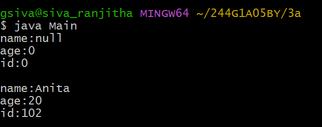
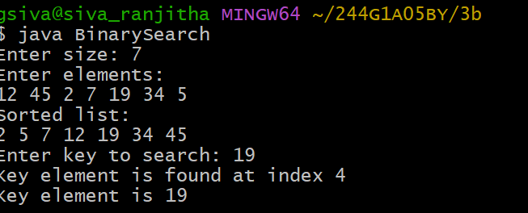
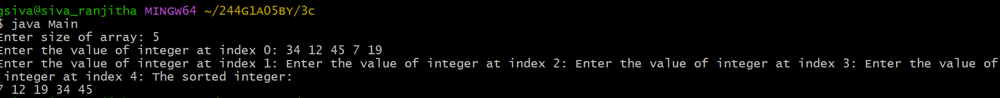

#EXPERIMENT-3
## 3a)Title:Constructor
```java
class Student {
    int id;
    String name;
    int age;

    Student() {
    }

    Student(int i, String n, int a) {
        id = i;
        name = n;
        age = a;
    }

    void display() {
        System.out.println("name:" + name);
        System.out.println("age:" + age);
        System.out.println("id:" + id);
        System.out.println();
    }
}

public class Main {
    public static void main(String[] args) {
        Student s1 = new Student();
        Student s2 = new Student(102, "Anita", 20);

        s1.display();
        s2.display();
    }
}
```
#Output:



##3b)Tittle: BinarySearch
```java
import java.util.Scanner;
import java.util.Arrays;

class BinarySearch {

    int list[];
    int size;
    int key = -1;

    BinarySearch(int size) {
        this.size = size;
        list = new int[size];
    }

    void set_list() {
        Scanner sc = new Scanner(System.in);
        for (int i = 0; i < list.length; i++) {
            list[i] = sc.nextInt();
        }
    }

    void get_list() {
        for (int i = 0; i < list.length; i++) {
            System.out.print(list[i] + " ");
        }
        System.out.println();
    }

    int binarysearch(int key) {
        int low = 0;
        int high = list.length - 1;

        while (low <= high) {
            int mid = (low + high) / 2;

            if (list[mid] == key) {
                return mid;
            } else if (list[mid] < key) {
                low = mid + 1;
            } else {
                high = mid - 1;
            }
        }
        return -1;
    }

    void getItem(int index) {
        System.out.println("Key element is found at index " + index);
        System.out.println("Key element is " + list[index]);
    }

    public static void main(String[] args) {
        Scanner sc = new Scanner(System.in);

        System.out.print("Enter size: ");
        int size = sc.nextInt();

        BinarySearch s = new BinarySearch(size);

        System.out.println("Enter elements:");
        s.set_list();

        Arrays.sort(s.list);   // IMPORTANT for binary search

        System.out.println("Sorted list:");
        s.get_list();

        System.out.print("Enter key to search: ");
        int key = sc.nextInt();

        int index = s.binarysearch(key);

        if (index != -1) {
            s.getItem(index);
        } else {
            System.out.println("Key element not found");
        }
    }
}
```
#Output:



##3c)Tittle:Bubblesort
```java
import java.util.Scanner;

class Bubblesort {
    void Bubblesort(int arr[]) {
        int n = arr.length;
        int temp = 0;

        for (int i = 0; i < n - 1; i++) {
            for (int j = 0; j < n - i - 1; j++) {
                if (arr[j] > arr[j + 1]) {
                    temp = arr[j + 1];
                    arr[j + 1] = arr[j];
                    arr[j] = temp;
                }
            }
        }
    }
}
import java.util.Scanner;

class Main {
    public static void main(String[] args) {
        Scanner sc = new Scanner(System.in);

        System.out.print("Enter size of array: ");
        int size = sc.nextInt();

        int[] integer = new int[size];

        for (int i = 0; i < size; i++) {
            System.out.print("Enter the value of integer at index " + i + ": ");
            integer[i] = sc.nextInt();
        }

        Bubblesort bs = new Bubblesort();
        bs.Bubblesort(integer);

        System.out.println("The sorted integer:");
        for (int i = 0; i < size; i++) {
            System.out.print(integer[i] + " ");
        }
    }
}
```
#Output:


