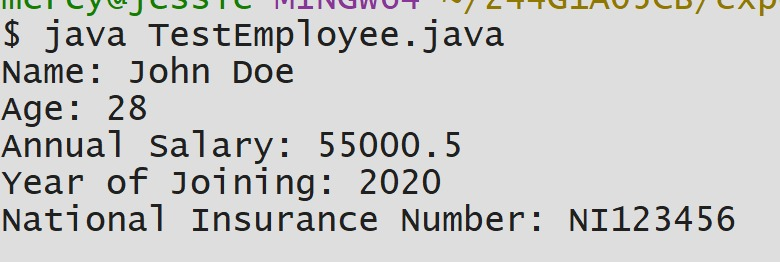
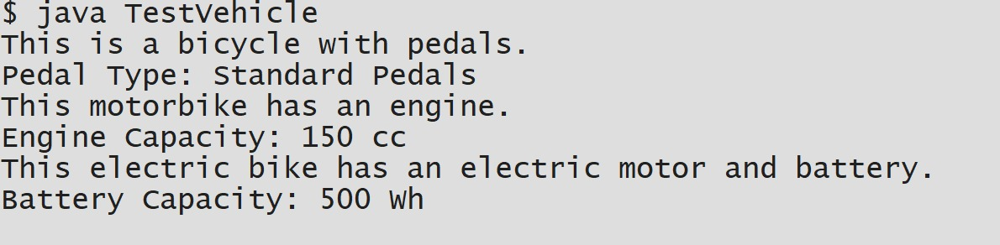

# EXPERIMENT-4
## TITLE: SINGLE INHERITANCE
```java
public class Person {
    String name;
    int age;

    // Constructor
    public Person(String name, int age) {
        this.name = name;
        this.age = age;
    }

    // Method to display person details
    public void displayPersonDetails() {
        System.out.println("Name: " + name);
        System.out.println("Age: " + age);
    }
}public class Employee extends Person {
    double annualSalary;
    int yearOfJoining;
    String nationalInsuranceNumber;

    // Constructor
    public Employee(String name, int age, double annualSalary, int yearOfJoining, String nationalInsuranceNumber) {
        super(name, age); // Call Person constructor
        this.annualSalary = annualSalary;
        this.yearOfJoining = yearOfJoining;
        this.nationalInsuranceNumber = nationalInsuranceNumber;
    }

    // Method to display employee details
    public void displayEmployeeDetails() {
        displayPersonDetails(); // Call parent method
        System.out.println("Annual Salary: " + annualSalary);
        System.out.println("Year of Joining: " + yearOfJoining);
        System.out.println("National Insurance Number: " + nationalInsuranceNumber);
    }
}
public class TestEmployee {
    public static void main(String[] args) {
        // Create Employee object
        Employee emp1 = new Employee("John Doe", 28, 55000.50, 2020, "NI123456");

        // Display Employee details
        emp1.displayEmployeeDetails();
    }
}
```



## Title:multi level inheritance
```java
public class Bicycle {
    String pedalType;

    public void showBicycleInfo() {
        System.out.println("This is a bicycle with pedals.");
        System.out.println("Pedal Type: " + pedalType);
    }
}
public class Motorbike extends Bicycle {
    int engineCapacity;

    public void showMotorbikeInfo() {
        System.out.println("This motorbike has an engine.");
        System.out.println("Engine Capacity: " + engineCapacity + " cc");
    }
}
public class ElectricBike extends Motorbike {
    int batteryCapacity;

    public void showElectricBikeInfo() {
        System.out.println("This electric bike has an electric motor and battery.");
        System.out.println("Battery Capacity: " + batteryCapacity + " Wh");
    }
}
 public class TestVehicle {
    public static void main(String[] args) {
        ElectricBike eBike = new ElectricBike();

        // Set values
        eBike.pedalType = "Standard Pedals";
        eBike.engineCapacity = 150;
        eBike.batteryCapacity = 500;

        // Call methods from all levels
        eBike.showBicycleInfo();       // From Bicycle
        eBike.showMotorbikeInfo();      // From Motorbike
        eBike.showElectricBikeInfo();   // From ElectricBike
    }
}
```



## Title: Abstract class
```java
abstract class Figure {
    double dim1, dim2;

    // Constructor
    Figure(double dim1, double dim2) {
        this.dim1 = dim1;
        this.dim2 = dim2;
    }

    // Abstract method
    abstract double area();
}
class Rectangle extends Figure {

    Rectangle(double length, double breadth) {
        super(length, breadth);
    }

    @Override
    double area() {
        return dim1 * dim2;
    }
}
class Triangle extends Figure {

    Triangle(double base, double height) {
        super(base, height);
    }

    @Override
    double area() {
        return 0.5 * dim1 * dim2;
    }
}
public class TestFigure {
    public static void main(String[] args) {

        // Rectangle object using Figure reference
        Figure f1 = new Rectangle(10, 5);
        System.out.println("Area of Rectangle = " + f1.area());

        // Triangle object using Figure reference
        Figure f2 = new Triangle(8, 6);
        System.out.println("Area of Triangle = " + f2.area());
    }
}
```

